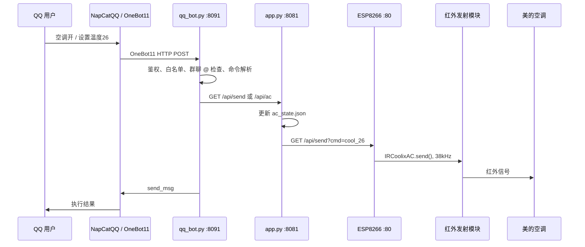

# Architecture

本项目把 QQ 消息入口、空调控制状态、ESP8266 红外发射拆成三层，方便单独调试。

## 进程职责

`qq_bot.py`：

- 监听 OneBot11 HTTP POST，默认端口 `8091`。
- 支持私聊和群聊 @机器人。
- 做 Token 校验、QQ 白名单、群白名单。
- 把中文命令转换成 Orange Pi 本地空调控制 API。
- 调用 NapCat `/send_msg` 回复结果。

`app.py`：

- 监听空调控制 HTTP API，默认端口 `8081`。
- 读取和写入 `ac_state.json`。
- 把 `power_on`、`power_off`、`cool_26` 等命令转发到 ESP8266。
- 提供 `/health` 和 `/api/state` 方便排障。

`ir_test.py`：

- 保留原测试入口名称。
- 当前不直接发红外，统一调用 ESP8266 HTTP API。
- 可直接命令行测试：`python orange-pi/ir_test.py send cool_26`。

ESP8266：

- 连接 Orange Pi 热点 `AC_Remote_AP`。
- 暴露 `/ping`、`/api/state`、`/api/send`、`/api/ac`。
- 使用 `IRremoteESP8266` 的 `IRCoolixAC` 以 38kHz 发送 COOLIX 协议。

## 端口

| 组件 | 默认地址 |
| --- | --- |
| qq_bot.py | `0.0.0.0:8091` |
| app.py | `0.0.0.0:8081` |
| ESP8266 | `http://<ESP8266_IP>:80` |
| Orange Pi 热点 | `192.168.10.1/24` |

